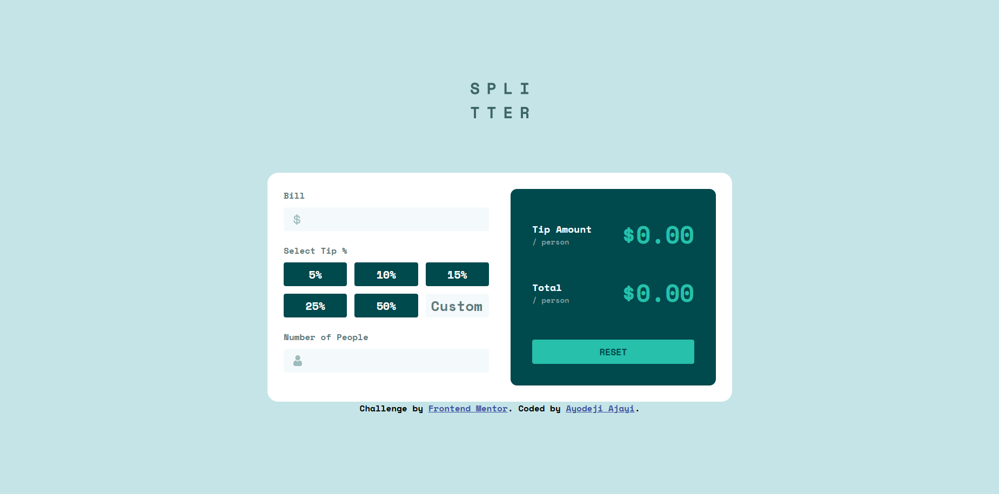

# Frontend Mentor - Tip calculator app solution

This is a solution to the [Tip calculator app challenge on Frontend Mentor](https://www.frontendmentor.io/challenges/tip-calculator-app-ugJNGbJUX). Frontend Mentor challenges help you improve your coding skills by building realistic projects.

## Table of contents

- [Overview](#overview)
  - [The challenge](#the-challenge)
  - [Screenshot](#screenshot)
  - [Links](#links)
- [My process](#my-process)
  - [Built with](#built-with)
  - [What I learned](#what-i-learned)
  - [Continued development](#continued-development)
  - [Useful resources](#useful-resources)
- [Author](#author)
- [Acknowledgments](#acknowledgments)

## Overview

### The challenge

Users should be able to:

- View the optimal layout for the app depending on their device's screen size
- See hover states for all interactive elements on the page
- Calculate the correct tip and total cost of the bill per person

### Screenshot



### Links

- Solution URL: [Add solution URL here](https://your-solution-url.com)
- Live Site URL: [Add live site URL here](https://your-live-site-url.com)

## My process

### Built with

- Semantic HTML5 markup
- CSS custom properties
- Flexbox
- CSS Grid
- Mobile-first workflow

### What I learned

I had some help but I put some of the DRY into work in my JS script

**Before DRY**
```JS
function validate_input(input, error_span = null){
    let value = Number(input.value);

    if(input.id === 'bill'){
        if(value <= 0){
            input.style.borderColor = 'var(--red)';
            input.style.outlineColor= 'var(--red)';
            if(error_span) error_span[0].style.display = 'block';
            
            return null
        }

        else{
            input.style.borderColor = 'transparent';
            input.style.outlineColor= 'var(--green_active)';
            if(error_span) error_span[0].style.display = 'none';
            
            return value
        }
    } 

    if(input.id === 'people'){
        if(value <= 0){
            input.style.borderColor = 'var(--red)';
            input.style.outlineColor= 'var(--red)';
            if(error_span) error_span[1].style.display = 'block';
            
            return null

        }

        else{
            input.style.borderColor = 'transparent';
            input.style.outlineColor= 'var(--green_active)';
            if(error_span) error_span[1].style.display = 'none';
            
            return value

        }

    }
    return value
}
```

**After DRY**
```python
function validate_input(input, error_span = null){
    const error_map = {
        'bill': 0,
        'people': 1  

    }

    const value = Number(input.value)
    const error_index = error_map[input.id]
    const is_invalid = value <= 0
    
    input.style.borderColor = is_invalid ? 'var(--red)' : 'transparent'
    input.style.outlineColor = is_invalid ? 'var(--red)' : 'var(--green_active)'
  

    if (error_span && error_index != undefined){
        error_span[error_index].style.display = is_invalid ? 'block' : 'none'
    }


    return is_invalid ? value : null
}
```

### Continued development

- Keep learning how to write clean understandable Code

- I am going to be focusing on my Javascript fundamentals as I push to learn React.

## Author

please pardon my website, I built it a while ago😂.

- Website - [Ayodeji Ajayi](https://portfolio-web-phi-jade.vercel.app/)
- Frontend Mentor - [bilegyr06](https://www.frontendmentor.io/profile/bilegyr06)
- Instagram - [Deji](https://www.instagram.com/ay0deji.a/)
